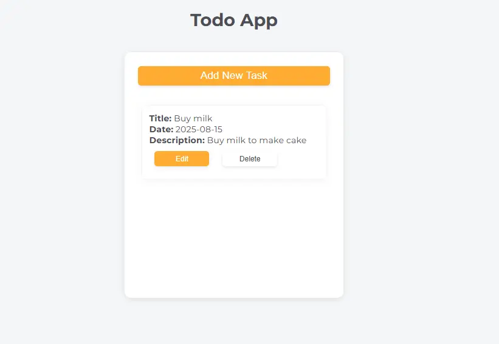

# 📝 To-Do App

A simple and interactive **To-Do List Application** built as part of the [FreeCodeCamp JavaScript Algorithms and Data Structures](https://www.freecodecamp.org/learn/javascript-algorithms-and-data-structures-v8/) curriculum.  
This project focuses on **JavaScript fundamentals** such as DOM manipulation, event handling, and **localStorage** for persistent data.

## 📸 Preview



## 📌 Features

- ➕ **Add tasks** to your list.
- ✅ **Mark tasks as completed**.
- 🗑 **Delete tasks** individually.
- 💾 **Data persistence** using `localStorage`.
- 🎯 Clean and minimal user interface.


## 🛠 Technologies Used

- **HTML5**
- **CSS3**
- **JavaScript (ES6+)**
- **localStorage API**


## 📂 Project Structure

```bash

├── index.html # Main HTML file
├── style.css # Styles
└── script.js # App logic and localStorage handling

```

## 📖 Lessons Learned

- How to use **localStorage** for saving data between sessions.
- How to structure a small JavaScript project for clarity and maintainability.


## 🧑‍💻 How to Use


1. Clone this repository:
```bash

git clone https://github.com/<your-username>/todo-app.git

Open the index.html file in your browser.

Start adding your tasks!

```

## 📜 License

This project is part of the FreeCodeCamp curriculum and is available for learning purposes.
